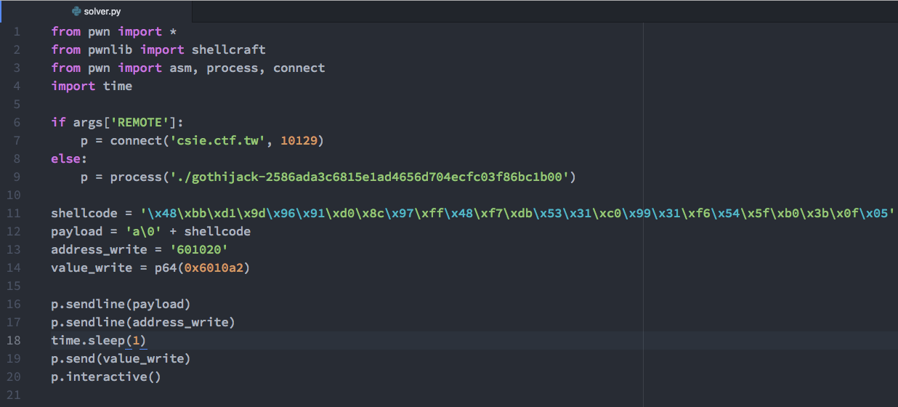
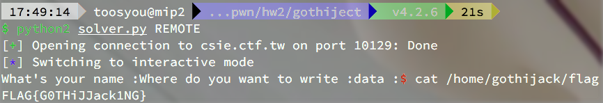

# CTF HW2 - GOThijack
###### 0316313 張逸群
## Observation
### main function

* 觀察 decompile 的結果可以發現：  
    * main function 先輸入 `0x30` 個字元存在 `0x6010a0` 位置
    * 其後以 `check` 確認輸入是否合法
    * 之後輸入 `0x18` 長度的位置，並使用 `WriteSomething` 寫入數值至該位置
    * Canary 有開啟，stack 第一位必須維持  
        * 但並沒有發現可以操作 stack 的地方

### check function

* 觀察 decompile 的結果可以發現：
    * 其先使用 `strlen(var_28)` 得到字串長度
    * 之後 iterate 過字串長度
        * 用 `isalnum` check 每一個字元是否為英文或數字
        * 因此無法在字串長度內放入 `shellcode`
        * 可輸入 `a\0` + `shellcode` 便不會檢查 `shellcode` 的部分
    * 最後 `return 0` 視為成功， `return 1` 為失敗

### WriteSomething function

* 其使用 `read_input` 輸入 `0x8` 長度進入 `arg0` 位置
* 之後 call `puts` 輸出 __done!__
    * 此處可以使用 `GOThijack` 更改 `puts` 的 `got` 內容
    * `got` 位置為 `0x601020`
    * 

## Solver

* 使用長度為 `25` 的 `shellcode`
* 送出 `payload` 為 `a\0` + `shellcode`
    * `shellcode` 的部分便不會被 `check` 檢查
* 將 `put@got` 的位置 `0x601020` 更改為 `shellcode` 的位置 `0x6010a2`
* 其後便可以執行 `shellcode` 得到 __flag__
    * 
