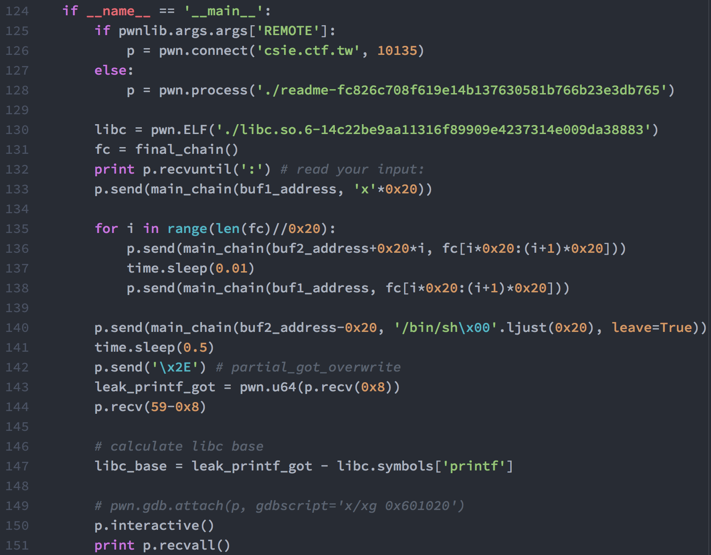

# CTF HW3 - Readme
###### 0316313 張逸群
## Observation
* 主程式
    * 
    * 可以發現在第 9 行的地方對 buf 進行 read，有 buffer overflow 的漏洞
    * 但僅可以 overflow 0x10 的空間，因此須先 overflow `rbp` 以及 `ret`
    * 其後使用 `read gadget` 進行 `rop chain` 的寫入
* read gadget
    * 
    * 因為其後接著 `leave` 以及 `ret`，須先控制 `rbp` 並做 `stack migration`
        * 此次作業是用兩段記憶體空間進行輪流寫入，以寫出 `final rop chain`
* vmmap
    * 
    * 可以發現在 `0x601000 - 0x602000` 的地方可以進行讀寫
        * 其中開頭及結尾的部分被程式使用，需避開
    * 可將 `stack` `rop chain` 放置至此
* partial got hijack
    * 
    * `stack` 在 `0x601000 - 0x602000` 的位置並**不足夠**使用 `printf` 進行 leaking
    * 在 `read` function 內的 `0xf722e` 的位置有 `syscall`
        * 因此使用 partial got hijack 的方式
        * 將 `read@got` 第一個 `byte` 寫成 `0x2e` 即可使用 `read@plt` 呼叫 `syscall`

## Solver
* 使用 `read gadget` 以寫入 `rop chain`
    * 
    * `payload` 長度需為 `0x20`
    * 之後放入 `rbp address` 以進行 `stack migration`
    * 最後放入 `read gadget address`
* main function
    * 
    * 將 `final_chain` 塞入 `memory`
        1. 先進行第一次 `buffer overflow`，並將 `rbp` 設為 `buf1_address`
        2. 其後在 `buf1_address` 中寫入 `'x'*20 + buf2_address + read_gadget_address`
        3. 之後便可以在 `buf2_address` 寫入 `final_chain`，但只能寫入 `0x20` 的長度，設定 `rbp` 回 `buf1_address`
        4. 重複 `2-3` 步直到 `final_chain` 寫完
    * 將 `final_chain` 寫入之後便可以移到 `buf2_address-0x20` 的位置，開始進行 `final rop chain`
    * 寫入 `/bin/sh` 至 `buf1_address` 以便之後使用
* final chain
    * 
    * `final_chain` 先對 `read@got` 進行 partial got hijack
    * 之後以 `syscall` 進行 `write`，將 `59` 個 `byte` 輸出至 `stdout`，以便之後使用 `sys_execve`
    * 最後使用 `sys_execve` 執行 `/bin/sh`
    * 後面放入 `ret` padding，以方便先前的輸入
* partial got hijack
    * 
    * 使用 `rop chain` 以將 `read@got` 第一個 `byte` 寫成 `0x2e`
    * 其後 `read` 變成了 `syscall`
